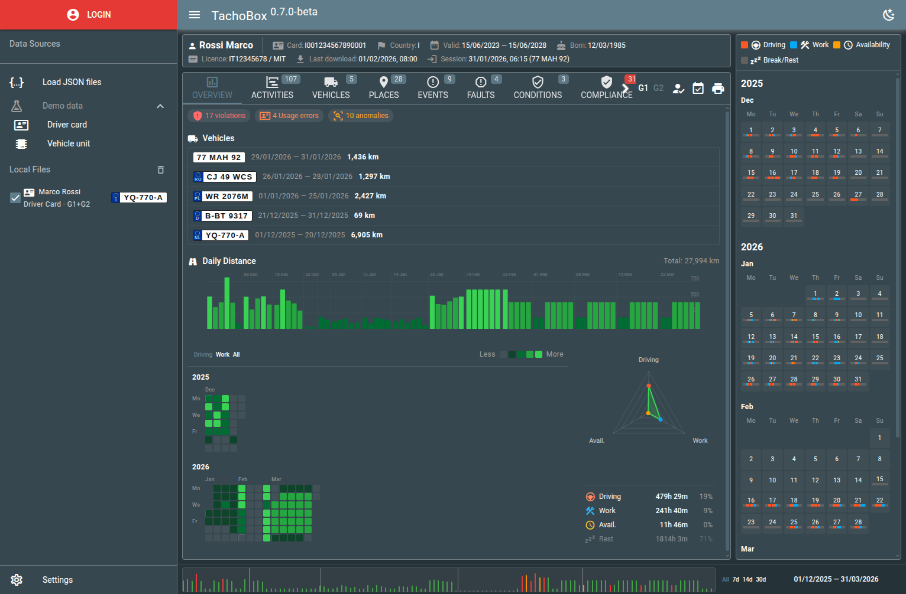

# TachoBox

Web-based viewer for tachograph DDD files parsed into JSON. Works with driver card and vehicle unit (VU) data, Gen1 and Gen2 formats, and analyses driving and rest times against EU Regulation 561/2006.

**[Live demo](https://tachobox.flespi.io/#/?demo=1)** | [Documentation](docs/overview.md) | [MIT licensed](LICENSE)



> **Disclaimer.** TachoBox is not an official or certified DDD file viewer. It is a way to explore and evaluate the contents of a tachograph file. The data it displays - including the compliance findings - must not be used for legal or regulatory purposes.

## Features

- **Overview** - vehicle list, daily distance chart, activity heatmap, driver profile radar
- **Activities** - table and timeline views with calendar sidebar
- **Day detail** - 24h clock disc, EU 561/2006 limit bars, violations, events, GNSS map
- **Compliance** - driving/rest violations (Art. 6, 7, 8), severity per Reg. (EU) 2016/403, anomaly detection, card/VU cross-reference
- **Map** - full route with GNSS waypoints (Gen2)
- **14 languages** - EN, BG, CS, DE, ES, FR, IT, LV, LT, NL, PL, RO, FI, SV
- **Embeddable** - iframe-friendly with URL parameters for deep linking

## Getting started

Requires Node.js 20 or newer.

```bash
npm install
npm run dev
```

Open http://localhost:8189 and load a JSON file, connect to a flespi device, or try the demo data.

```bash
npm run build     # production build -> dist/spa/
npm test          # unit tests (vitest)
npm run lint      # eslint
npm run format    # prettier
```

Built with [Vue 3](https://vuejs.org/) and [Quasar 2](https://quasar.dev/) on Vite, with Pinia, vue-i18n and Leaflet.

## Data sources

- **flespi** - log in, pick a device with the [tacho-file-parse](https://flespi.com/kb/tacho-file-parse-plugin) plugin, browse and load its DDD files
- **JSON file** - upload one or more parsed files from disk
- **URL** - `?jsonurl=https://example.com/data.json`
- **Demo** - `?demo=1` or click "Demo data" in the sidebar

### How your data is handled

TachoBox is a static single-page app with no backend of its own:

- JSON files opened from disk or via `jsonurl` are parsed **in the browser** and never uploaded anywhere.
- flespi data is fetched directly from **your own** flespi account with your own token.
- Decoding a raw `.ddd` binary is the one exception: the app has no binary parser, so the Upload flow sends the file to your flespi device, where the `tacho-file-parse` plugin decodes it. Files you upload this way are stored in your flespi media storage.
- Maps request tiles from [CARTO basemaps](https://carto.com/basemaps/); tile requests reveal the map area being viewed.

There is no analytics, tracking or third-party reporting in this codebase.

## URL parameters

| Parameter | Description |
|-----------|-------------|
| `demo` | `1` - load demo driver card data |
| `jsonurl` | URL to a JSON file to load on startup |
| `hidepanels` | `1` - hide header and sidebar (for embedding) |
| `hidecalendar` | `1` - hide the calendar sidebar |
| `hidedisclaimer` | `1` - hide the disclaimer banner |
| `tab` | Initial tab: `overview`, `activities`, `vehicles`, `places`, `events`, `faults`, `conditions`, `compliance`, `map` |
| `tabs` | Comma-separated list of visible tabs |
| `day` | Unix timestamp - open day detail dialog |
| `theme` | `light` or `dark` |
| `lang` | Locale code, e.g. `fr-FR` |

## Embedding

```html
<iframe
  src="https://tachobox.flespi.io/#/device/123/file/abc?token=TOKEN&hidepanels=1"
  width="100%" height="600" frameborder="0"
></iframe>
```

> Passing a token in the URL is convenient but it ends up in browser history, referrer headers and server logs. Use a short-lived flespi token restricted to the devices being viewed.

See [docs/overview.md](docs/overview.md) for full documentation.

## Compliance engine

The EU 561/2006 + 2016/403 violation logic lives in [`src/compliance/`](src/compliance/) as a
framework-free, dependency-free module - the numbers (`rules.js`) are separated from the
algorithms (`violations.js`) so it can be audited against the regulations and reused as a
standalone library. See [src/compliance/README.md](src/compliance/README.md).

The directory is self-contained: copy it anywhere and run its demo, which builds
sample activity inline and prints the findings. No data files, no build step.

```bash
cp -r src/compliance /tmp/compliance && node /tmp/compliance/example.mjs
```

### The pipeline

Getting from a tachograph file to a list of infringements is three stages, each
a separate framework-free module:

| Stage | Module | In -> out |
|-------|--------|-----------|
| 1. Normalize | [`src/utils/ddd.js`](src/utils/ddd.js) ([README](src/utils/README.md)) | flespi `tacho-file-parse` response -> activity records, one per day |
| 2. Analyse | [`src/compliance/`](src/compliance/) ([README](src/compliance/README.md)) | activity records -> violations, usage errors, anomalies |
| 3. Report | [`src/analyze.js`](src/analyze.js) | stages 1 and 2 in one call -> a plain JSON report |

Use stage 3 if you just want findings. Use stages 1 and 2 directly when you need
the intermediate records too - the app does exactly that, rendering the same
records as timelines and charts while the engine analyses them. Stage 2 alone is
what you want if your files come from somewhere other than flespi: it takes plain
records and has no idea where they came from.

Decoding the raw `.ddd` binary is *not* part of this - stage 1 starts from
already-parsed JSON. In this app that decoding is done server-side by the flespi
plugin; with another parser, produce the record shape yourself and start at
stage 2.

A fourth module sits outside the pipeline:
[`src/reference/`](src/reference/) ([README](src/reference/README.md)) holds the
static spec lookup tables - country codes, event and fault types - used to turn
numeric codes into labels.

### From a flespi API response to a report

If your input is what the flespi media API returns for a tacho file, the whole
pipeline is one call - [`src/analyze.js`](src/analyze.js) wires the normalization
adapter to the engine:

```js
import { analyze } from './src/analyze.js'

const report = analyze(apiResponse)   // or an array of responses to merge
// { rulesVersion, sources, summary, violations, usageErrors, anomalies }
```

`apiResponse` is the unmodified body of
`GET /gw/devices/{id}/media?data={uuid, fields:'uuid,name,meta,content'}`. The
bundled `public/example.json` is exactly such a response, which is why the same
file serves as the conformance input.

The same thing from the command line:

```bash
npm run violations -- public/example.json --pretty
# or: node scripts/find-violations.mjs <parsed.json> [more.json ...] [--gen g1|g2] [--pretty]

# pass several complementary files - successive downloads of the same card:
node scripts/find-violations.mjs day1.json day2.json day3.json --pretty
```

Multiple files are normalized and merged into one timeline (the same day from two
files keeps the richer record), then analysed together. They must be complementary -
the same driver card or the same vehicle unit; mixing different drivers/vehicles (or a
card with a VU) throws an error.

[`scripts/find-violations.mjs`](scripts/find-violations.mjs) is only argument
parsing and file reading around `analyze()`; import from
[`src/analyze.js`](src/analyze.js) rather than shelling out to the script.

### Reimplementing it in another language

The engine ships two generated artifacts so it can be ported without reading
JavaScript, and the port checked for equivalence:
[`src/compliance/rules.json`](src/compliance/rules.json) holds the statutory
limits and severity bands as plain data, and
[`test/conformance/`](test/conformance/) holds the expected report for each
bundled demo input. Run a port over `public/example.json`, emit the same report
shape, and diff. `npm run conformance:update` regenerates both, and a test fails
if they drift from the code. See
[Coverage and limits](src/compliance/README.md#coverage-and-limits) for what the
engine deliberately does not detect, and
[Algorithm notes](src/compliance/README.md#algorithm-notes) for the decisions a
port has to match.

## Project layout

| Path | Contents |
|------|----------|
| `src/compliance/` | Violation engine: rules, algorithms, explanations |
| `src/reference/` | Spec lookup tables (countries, event/fault codes) |
| `src/utils/` | DDD normalization, date/time formatting, geo and media helpers |
| `src/components/` | Charts, tables, maps, dialogs |
| `src/pages/`, `src/layouts/` | Page and shell composition |
| `src/stores/` | Pinia stores (data, auth, settings) |
| `src/i18n/` | 14 locales; the English string is the key |
| `test/` | Vitest suites, including a golden-master snapshot over the demo data |
| `scripts/` | `find-violations.mjs` CLI |
| `docs/` | Feature documentation |

## Contributing

Issues and pull requests are welcome.

- Run `npm run lint` and `npm test` before opening a PR.
- The test suite includes a golden-master snapshot of the compliance output over the bundled demo data. If a change is meant to alter violation results, update the snapshot deliberately and explain why in the PR - an unexplained snapshot change is a regression.
- Statutory thresholds belong in `src/compliance/rules.js`, never inline in the algorithms, and should cite the regulation they come from.
- UI strings go through vue-i18n: the English text is the key, so add new strings to every locale in `src/i18n/`.

[AGENTS.md](AGENTS.md) documents the same conventions in the form AI coding agents expect, along with the layering rules and the non-obvious pitfalls in this codebase.

## License

[MIT](LICENSE)
